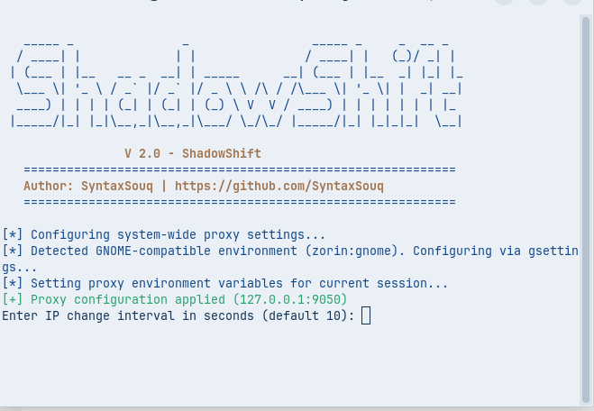
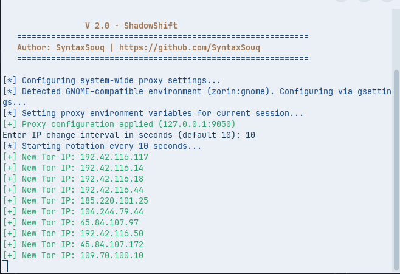
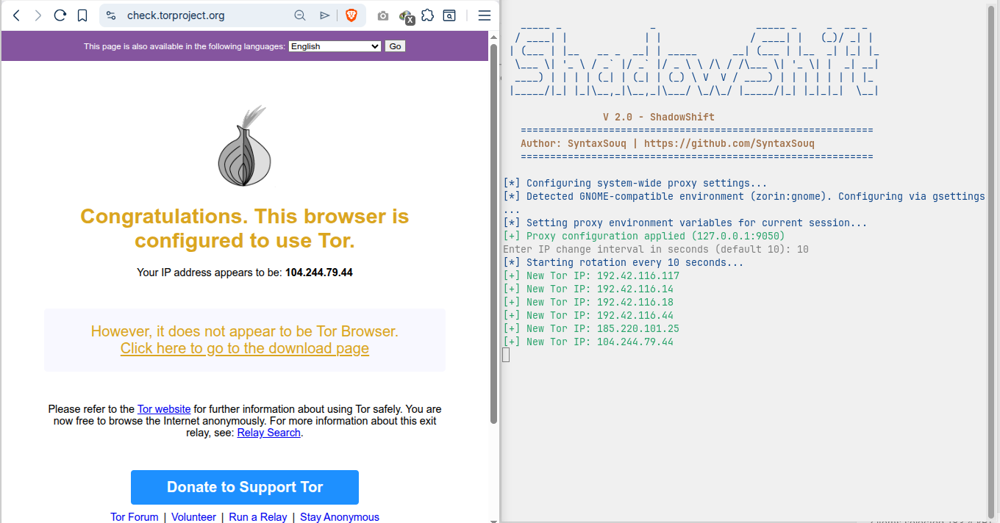

# 🌑 ShadowShift

**ShadowShift** is a sophisticated, high-performance IP rotation engine engineered for maximum privacy and security. By integrating directly with the **Tor (The Onion Router)** network, ShadowShift provides an automated way to "jump" your public IP address at intervals as low as every few seconds. 

Whether you are performing security audits, large-scale web scraping, or simply demand the highest level of online anonymity, ShadowShift ensures your traffic is untraceable by constantly shifting your digital footprint across the global Tor relay network.



---

## 🚀 Key Features

- **🔄 Automated IP Rotation**: Seamlessly signal Tor to establish new circuits and refresh your identity.
- **🛡️ Tor-Powered Anonymity**: Leverages the world-class encryption and relay system of Tor for untraceable browsing.
- **⚙️ Distribution-Agnostic Proxy**: Intelligent detection for GNOME, KDE Plasma, and CLI-only environments.
- **📦 Persistent Service Mode**: Run as a native `systemd` service for background operation.
- **📊 Real-Time Visibility**: Monitor your IP jumps in real-time with beautiful CLI logs.
- **🛠️ Multi-Tool Integration**: Optimized for Playwright, Puppeteer, and Python-based security tools.

---

## 📸 Screenshots

### Connection Status & Verification
ShadowShift automatically verifies your connection to the Tor network and updates your system-wide proxy settings.



### Live IP Rotation Logs
See ShadowShift in action as it rotates your IP address every few seconds, providing a continuous stream of new identities.



---

## 📥 Installation

### Prerequisites

- Linux-based OS (Ubuntu, Debian, Arch, Fedora, Kali, Parrot, etc.)
- Sudo privileges
- Internet connection

### Fast Setup

1. **Clone the repository**:
   ```bash
   git clone https://github.com/SyntaxSouq/ShadowShift.git
   cd ShadowShift
   ```

2. **Run the installation script**:
   ```bash
   sudo ./setup.sh
   ```
   The installer will automatically detect your OS, install dependencies (tor, curl, jq, xxd), and configure your system.

---

## 📖 Usage

### Running in Foreground

To run ShadowShift manually and see real-time updates:
```bash
sudo ./shadowshift.sh
```

### Command Line Arguments

- `sudo ./shadowshift.sh [interval]`: Start rotation with a specific interval (e.g., `10` for 10 seconds).
- `sudo ./shadowshift.sh --status`: Check the current public IP through the Tor proxy.
- `sudo ./shadowshift.sh --stop`: Disable the system-wide proxy settings.

### Service Management

If you installed ShadowShift as a service:
- **Check Status**: `systemctl status shadowshift.service`
- **Stop Service**: `sudo systemctl stop shadowshift.service`
- **Start Service**: `sudo systemctl start shadowshift.service`
- **View Logs**: `tail -f /var/log/shadowshift.log`

---

## 🔗 Integration Examples

### Playwright (JavaScript)

```javascript
const { chromium } = require('playwright');

(async () => {
  const browser = await chromium.launch({
    proxy: { server: 'socks5://127.0.0.1:9050' }
  });
  // Your code here...
})();
```

---

## 🗺️ Roadmap

- [ ] **Multi-Proxy Support**: Support for I2P and custom SOCKS5 proxies.
- [ ] **Web UI**: A lightweight local dashboard to monitor IP changes.
- [ ] **Docker Support**: Containerized version for easy deployment in CI/CD.
- [ ] **Geo-Filtering**: Ability to request IPs from specific countries/regions.

---

## 🤝 Contributing

Contributions are welcome! Please follow these steps:
1. Fork the project.
2. Create your feature branch (`git checkout -b feature/AmazingFeature`).
3. Commit your changes (`git commit -m 'Add some AmazingFeature'`).
4. Push to the branch (`git push origin feature/AmazingFeature`).
5. Open a Pull Request.

---

## ⚖️ License

Distributed under the MIT License. See [LICENSE](LICENSE) for more information.

---

## 👤 Author

**SyntaxSouq**
- GitHub: [@SyntaxSouq](https://github.com/SyntaxSouq)

---

> **Disclaimer**: This tool is for educational and ethical testing purposes only. Use it responsibly and comply with local laws and terms of service of the websites you visit. ShadowShift is not affiliated with the Tor Project.

